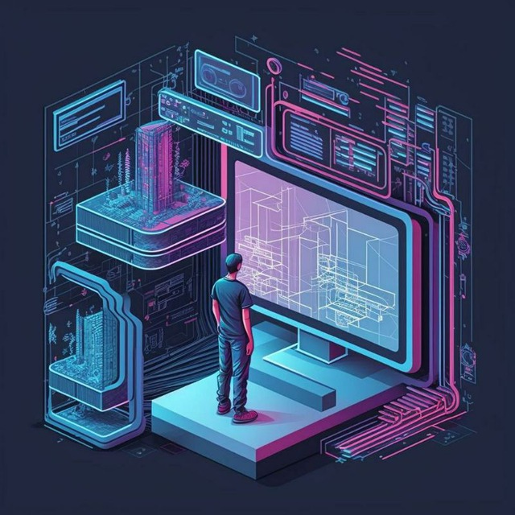

# Computer Essentials Workshop
This workshop is designed for programmers seeking to grasp essential computer knowledge.

## Agenda:
* 0. Intro + What we have here
* 1. OS + Computer Parts
* 2. CPU Vs GPU + Swap
* 3. CPU + BIOS + Virtualization
* 4. Linux structure and basic commands
* 5. Linux permissions
* 6. Update OS, Packages + Manage Users, Groups + Versioning
* 7. Network basics, Topologies, OSI, Network devices
* 8. Network protocols
* 9. Git + Github + Gitlab + CI + Cd
* 10. Docker + Dockerfile + Docker-compose
* 11. Outro + Learning paths + Course Suggestions

## Session Details
- Conducted online
- Held in October, November, and December
- Consisted of 10 sessions, each approximately 3 hours long

## Instructor
- Mahdighaemi